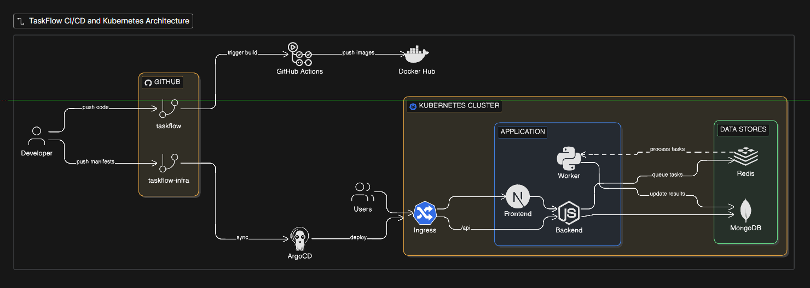

# Argo CD Setup Guide

## Architecture



*The CI/CD layout and Kubernetes networking architecture for the TaskFlow platform.*

Follow these steps to install and configure Argo CD on your local Kubernetes cluster.

## 1. Install Argo CD

Open your PowerShell terminal and run these commands one by one to install Argo CD into your cluster:

```powershell
# Create the namespace
kubectl create namespace argocd

# Apply the installation manifest
kubectl apply -n argocd -f https://raw.githubusercontent.com/argoproj/argo-cd/stable/manifests/install.yaml

# Watch the pods until they all show as "Running" (Press Ctrl+C to exit)
kubectl get pods -n argocd -w
```
*Wait until all 7 pods say `Running` before proceeding.*

## 2. Access the Argo CD UI

### Step 2a: Port Forward (Keep this window open)
In your current terminal, run the following command to make the UI accessible on localhost:
```powershell
kubectl port-forward svc/argocd-server -n argocd 8080:443
```
**Leave this window running.** Open a *NEW* PowerShell window for the next steps.

### Step 2b: Get Admin Password (New window)
In your new terminal window, run this command to extract and decode the initial admin password:
```powershell
kubectl -n argocd get secret argocd-initial-admin-secret -o jsonpath="{.data.password}" | ForEach-Object { [System.Text.Encoding]::UTF8.GetString([System.Convert]::FromBase64String($_)) }
```
*Copy the output — that's your password.*

### Step 2c: Open Browser
1. Go to: `https://localhost:8080`
2. Chrome will show a warning — click **Advanced** → **Proceed to localhost (unsafe)**
3. Login using:
   - **Username:** admin
   - **Password:** *[paste what you copied above]*

## 3. Generate a GitHub Personal Access Token (PAT)

If you have a private repository or hit rate limits, you need a token.

1. Go to **github.com**
2. Click your profile picture → **Settings**
3. Scroll down → **Developer settings**
4. **Personal access tokens** → **Tokens (classic)**
5. **Generate new token (classic)**
6. Note: `argocd-access`
7. Check only the **`repo`** checkbox.
8. Click **Generate token**.
9. **Copy it immediately** — you won't see it again!

## 4. Connect GitHub Repository in Argo CD

In your browser at `https://localhost:8080`:

1. Click **Settings** (gear icon, left sidebar)
2. Click **Repositories**
3. Click **+ Connect Repo**
4. Fill in exactly:
   - **Choose connection method:** HTTPS
   - **Type:** git
   - **Project:** default
   - **Repository URL:** `https://github.com/Tanveer-rajpurohit/taskflow-infra`
   - **Username:** *[your-github-username]*
   - **Password:** *[paste-your-PAT-token-here]*
5. Click **Connect**.
*It should show a green ✅ Successful.*

## 5. Deploy the Taskflow Application via Argo CD

Run this script in PowerShell to quickly create the Application manifest and apply it:

```powershell
# 1. Create the Application file locally
@"
apiVersion: argoproj.io/v1alpha1
kind: Application
metadata:
  name: taskflow
  namespace: argocd
spec:
  project: default
  source:
    repoURL: https://github.com/Tanveer-rajpurohit/taskflow-infra
    targetRevision: HEAD
    path: local
  destination:
    server: https://kubernetes.default.svc
    namespace: taskflow
  syncPolicy:
    automated:
      prune: true
      selfHeal: true
    syncOptions:
      - CreateNamespace=true
"@ | Out-File -FilePath "$HOME\argocd-app.yaml" -Encoding utf8

# 2. Apply it to the cluster
kubectl apply -f "$HOME\argocd-app.yaml"

# 3. Check its initial status
kubectl get applications -n argocd

# 4. View detailed information about the application
kubectl describe application taskflow -n argocd
```

Once applied, the application will appear in the Argo CD UI web page, and it will begin synchronizing your `taskflow` deployment to the cluster automatically.

## 6. Troubleshooting: After a PC / Docker Restart

If you restart your computer or Docker, local Kubernetes might not shut down gracefully. This can cause Argo CD pods (especially the repo server) to get stuck, leading to errors in the Argo CD dashboard like `connection refused` or `Unable to load data`.

To fix this and wake Argo CD back up, run this command in your terminal:

```powershell
kubectl rollout restart deployment -n argocd
# (Or optionally restart the statefulsets and pods)
kubectl delete pod --force -n argocd -l app.kubernetes.io/name=argocd-repo-server
```

After running that command to recreate the stuck pods:
1. Wait about 30 seconds for the pods to restart.
2. Go back to your Argo CD dashboard (`https://localhost:8080`).
3. Click the **Refresh** and **Sync** buttons on your `taskflow` application to get everything cleanly connected and synced again.
